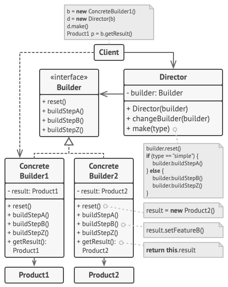
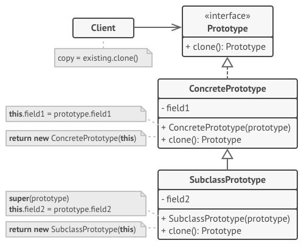
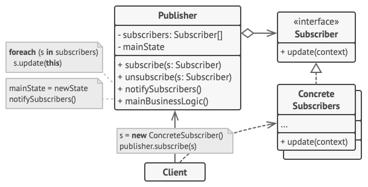

## Creational Patterns:


- #### Singleton: Create a Logger class that ensures only one instance of the logger exists.


<details>
<summary align="center"><h4>Solution</h4></summary>

```java
/**
 * Logger class implementing the Singleton design pattern.
 * This class ensures that only one instance of Logger is created throughout the application.
 */
public class Logger {

    // The single instance of Logger that will be used throughout the application.
    private static Logger logger;

    // Private constructor to prevent instantiation of the Logger class from outside the class.
    private Logger() {
    }

    /**
     * Method to get the single instance of Logger.
     * If the instance does not exist, it is created.
     * @return the single instance of Logger.
     */
    public static Logger getLogger() {
        if (logger == null) {
            logger = new Logger();
        }
        return logger;
    }
}
```
</details>

- #### Factory Method: Create a ShapeFactory that generates different types of Shape objects (like Circle, Rectangle, Square) based on the input it receives.


<details>
<summary align="center"><h4>Solution</h4></summary>

```java
/**
 * Shape interface that all shapes will implement.
 */
public interface Shape {
    /**
     * Method to draw the shape.
     * @return A string describing the drawing action.
     */
    String draw();
}

/**
 * Circle class that implements the Shape interface.
 */
class Circle implements Shape {
    /**
     * Method to draw a Circle.
     * @return A string stating that a Circle is being drawn.
     */
    @Override
    public String draw() {
        return "Drawing a Circle";
    }
}

/**
 * Square class that implements the Shape interface.
 */
class Square implements Shape {
    /**
     * Method to draw a Square.
     * @return A string stating that a Square is being drawn.
     */
    @Override
    public String draw() {
        return "Drawing a Square";
    }
}

/**
 * Rectangle class that implements the Shape interface.
 */
class Rectangle implements Shape {
    /**
     * Method to draw a Rectangle.
     * @return A string stating that a Rectangle is being drawn.
     */
    @Override
    public String draw() {
        return "Drawing a Rectangle";
    }
}

/**
 * Abstract class ShapeCreator that defines the factory method.
 */
public abstract class ShapeCreator {
    /**
     * Abstract method to create a Shape.
     * @return A Shape object.
     */
    public abstract Shape createShape();
}

/**
 * CircleCreator class that extends ShapeCreator.
 */
public class CircleCreator extends ShapeCreator {
    /**
     * Method to create a Circle.
     * @return A Circle object.
     */
    @Override
    public Shape createShape() {
        return new Circle();
    }
}

/**
 * SquareCreator class that extends ShapeCreator.
 */
public class SquareCreator extends ShapeCreator {
    /**
     * Method to create a Square.
     * @return A Square object.
     */
    @Override
    public Shape createShape() {
        return new Square();
    }
}

/**
 * RectangleCreator class that extends ShapeCreator.
 */
public class RectangleCreator extends ShapeCreator {
    /**
     * Method to create a Rectangle.
     * @return A Rectangle object.
     */
    @Override
    public Shape createShape() {
        return new Rectangle();
    }
}
```
</details>

- #### Abstract Factory: Extend the previous exercise to have an AbstractFactory that produces ShapeFactory and ColorFactory. The ColorFactory should be able to produce different Color objects.


<details>
<summary align="center"><h4>Solution</h4></summary>

```java
// Common interfaces
public interface Shape {
    String draw();
}

public interface Color {
    String fill();
}

// Concrete Shape classes
class Circle implements Shape {
    @Override
    public String draw() {
        return "Drawing a Circle";
    }
}

class Square implements Shape {
    @Override
    public String draw() {
        return "Drawing a Square";
    }
}

class Rectangle implements Shape {
    @Override
    public String draw() {
        return "Drawing a Rectangle";
    }
}

// Concrete Color classes
class Red implements Color {
    @Override
    public String fill() {
        return "Filling with Red color";
    }
}

class Green implements Color {
    @Override
    public String fill() {
        return "Filling with Green color";
    }
}

class Blue implements Color {
    @Override
    public String fill() {
        return "Filling with Blue color";
    }
}

// Abstract Factory
abstract class AbstractFactory {
    abstract Shape getShape(String shapeType);

    abstract Color getColor(String colorType);
}

// Concrete Factories
class ShapeFactory extends AbstractFactory {
    @Override
    Shape getShape(String shapeType) {
        if (shapeType == null) {
            return null;
        }
        if (shapeType.equalsIgnoreCase("CIRCLE")) {
            return new Circle();
        } else if (shapeType.equalsIgnoreCase("RECTANGLE")) {
            return new Rectangle();
        } else if (shapeType.equalsIgnoreCase("SQUARE")) {
            return new Square();
        }
        return null;
    }

    @Override
    Color getColor(String colorType) {
        return null;
    }
}

class ColorFactory extends AbstractFactory {
    @Override
    Shape getShape(String shapeType) {
        return null;
    }

    @Override
    Color getColor(String colorType) {
        if (colorType == null) {
            return null;
        }
        if (colorType.equalsIgnoreCase("RED")) {
            return new Red();
        } else if (colorType.equalsIgnoreCase("GREEN")) {
            return new Green();
        } else if (colorType.equalsIgnoreCase("BLUE")) {
            return new Blue();
        }
        return null;
    }
}

```
</details>

- #### Builder: Design a PizzaBuilder where you can customize a Pizza object step by step, choosing the type of crust, toppings, size, etc.



<details>
<summary align="center"><h4>Solution</h4></summary>

```java
public class Pizza {
    private String size;
    private String crust;
    private List<String> topping;

    Pizza(PizzaBuilder builder) {
        this.size = builder.size;
        this.crust = builder.crust;
        this.topping = builder.topping;
    }

    public String getSize() {
        return size;
    }

    public String getCrust() {
        return crust;
    }

    public List<String> getTopping() {
        return topping;
    }

    public static class PizzaBuilder {
        String size;
        String crust;
        List<String> topping;

        public PizzaBuilder withSize(String size) {
            this.size = size;
            return this;
        }

        public PizzaBuilder withCrust(String crust) {
            this.crust = crust;
            return this;
        }

        public PizzaBuilder withToppings(List<String> topping) {
            this.topping = topping;
            return this;
        }

        public Pizza build() {
            return new Pizza(this);
        }
    }
}
```
</details>

- #### Prototype: Implement a Cell class that can replicate itself.



<details>
<summary align="center"><h4>Solution</h4></summary>

```java
public interface Cell {
    Cell copy();
}
public class ConcreteCell implements Cell {
    private final String geneticMaterial;
    private final int age;

    public ConcreteCell(String geneticMaterial, int age) {
        this.geneticMaterial = geneticMaterial;
        this.age = age;
    }

    public ConcreteCell(ConcreteCell otherCell) {
        this.geneticMaterial = otherCell.geneticMaterial;
        this.age = otherCell.age;
    }

    @Override
    public ConcreteCell copy() {
        return new ConcreteCell(this);
    }

    @Override
    public boolean equals(Object obj) {
        if (this == obj) {
            return true;
        }
        if (obj == null || getClass() != obj.getClass()) {
            return false;
        }
        ConcreteCell otherCell = (ConcreteCell) obj;
        return age == otherCell.age &&
                Objects.equals(geneticMaterial, otherCell.geneticMaterial);
    }

    @Override
    public int hashCode() {
        return Objects.hash(geneticMaterial, age);
    }
}
```
</details>

## Structural Patterns:

- #### Adapter: Create a MediaPlayer interface and a MediaAdapter class to play different types of audio formats.

<details>
<summary align="center"><h4>Solution</h4></summary>

```java
```
</details>

- #### Bridge: Design a Shape abstraction and several Shape implementations like Circle, Square. Also create a Color interface and several Color implementations like Red, Blue. The Shape class uses the Color interface to fill itself with color.

<details>
<summary align="center"><h4>Solution</h4></summary>

```java
```
</details>

- #### Composite: Implement an Employee class, where an employee can have a list of other employees reporting to them.

<details>
<summary align="center"><h4>Solution</h4></summary>

```java
```
</details>

- #### Decorator: Create a Coffee interface and use decorator pattern to add different types of toppings.

<details>
<summary align="center"><h4>Solution</h4></summary>

```java
```
</details>

- #### Facade: Create a Computer class that has a start() method, which internally calls methods from CPU, Memory, and HardDrive.

## Behavioral Patterns:

- #### Observer: Implement a WeatherStation that notifies WeatherDisplay objects whenever it updates its measurements.



<details>
<summary align="center"><h4>Solution</h4></summary>

```java
public interface WeatherStation {
    void addObserver(WeatherDisplay observer);
    void removeObserver(WeatherDisplay observer);
    void notifyObservers();
    void setMeasurements(float temperature, float humidity, float pressure); // Added declaration
}

public class ConcreteWeatherStation implements WeatherStation {
    private float temperature;
    private float humidity;
    private float pressure;
    private List<WeatherDisplay> observers = new ArrayList<>();

    public void setMeasurements(float temperature, float humidity, float pressure) {
        this.temperature = temperature;
        this.humidity = humidity;
        this.pressure = pressure;
        notifyObservers();
    }

    @Override
    public void addObserver(WeatherDisplay observer) {
        observers.add(observer);
    }

    @Override
    public void removeObserver(WeatherDisplay observer) {
        observers.remove(observer);
    }

    @Override
    public void notifyObservers() {
        for (WeatherDisplay observer : observers) {
            observer.update(temperature, humidity, pressure);
        }
    }
}

public interface WeatherDisplay {
    void update(float temperature, float humidity, float pressure);
}

public class CurrentConditionsDisplay implements WeatherDisplay {
    @Override
    public void update(float temperature, float humidity, float pressure) {
        System.out.println("Current conditions: " + temperature + "F degrees, " + humidity + "% humidity");
    }
}
```
</details>

- #### State: Design a TrafficLight that changes its State from Red to Green to Yellow.

<details>
<summary align="center"><h4>Solution</h4></summary>

```java
```
</details>

- #### Strategy: Implement a ShoppingCart where the payment strategy (CreditCard, Paypal) can be chosen at runtime.

<details>
<summary align="center"><h4>Solution</h4></summary>

```java
```
</details>

- #### Template Method: Create an Algorithm abstract class with a template method solveProblem(), and let ConcreteAlgorithmA and ConcreteAlgorithmB classes implement this method.

<details>
<summary align="center"><h4>Solution</h4></summary>

```java
```
</details>

- #### Visitor: Implement Book, CD and DVD classes. They can accept a Visitor like ShippingVisitor which calculates the shipping cost for the items.
